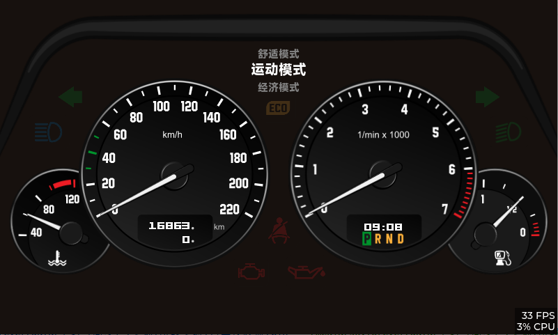

# LVGL 跨平台汽车仪表盘模拟器

这是一个基于 [LVGL](https://lvgl.io) 图形库构建的、功能丰富的汽车仪表盘模拟器。项目被设计为**跨平台**的，既可以在 **Linux PC** 上通过 SDL 进行快速开发和预览，也可以直接交叉编译，在**嵌入式 ARM Linux** 开发板 (如 GEC6818) 上通过 Framebuffer (`/dev/fb0`) 高效运行。

最重要的是，项目已**内置预编译的 `freetype` 库**，无需手动安装，实现了开箱即用。



---

## ✨ 功能特性

- **跨平台支持**: 一套代码，无缝支持 PC (SDL) 与 嵌入式 Linux (Framebuffer)。
- **依赖自包含**: 内置 `freetype` 库，无需系统级安装，简化了环境配置。
- **实时仪表模拟**: 动态显示速度、转速、水温和油量，指针带有平滑的动画效果。
- **指示灯与告警**: 包括左右转向灯、远光灯、安全带未系提醒、高温、低油量和胎压异常告警。
- **启动自检模式**: 程序启动前2秒会自动点亮所有指示灯，方便检查UI元素是否正常。
- **控制台实时交互**: 无需重新编译，直接在终端输入指令即可模拟各种车辆数据变化。

## 📦 环境准备

得益于自包含的依赖，您需要准备的环境非常少。

#### 1. 对于 PC / SDL 开发与仿真

- **Git**, **CMake** (版本 3.12+), **C/C++ 编译器** (如 `build-essential`)
- **SDL2 开发库** (这是唯一需要在 PC 上安装的外部依赖):
  ```bash
  # 对于 Ubuntu/Debian 系统
  sudo apt-get install libsdl2-dev
  ```

#### 2. 对于嵌入式 ARM Linux (以 GEC6818 为例)

- **ARM 交叉编译工具链**: 例如 `arm-linux-gcc 5.4.0`。

**您无需手动安装 FreeType 库 (`libfreetype-dev`)**，本项目已在 `libs/` 目录下为您准备好了！

## 🚀 快速上手 (Getting Started)

首先，克隆仓库：
```bash
git clone https://github.com/zhangwei43721/LVGL-CarDashboard.git
cd LVGL-CarDashboard
```

接下来，根据你的目标平台选择相应的构建方式。

### 方式一: 在 PC 上编译和运行 (用于开发/预览)

这种方式会生成一个本地可执行文件，并使用 SDL 窗口来显示仪表盘。

1.  **编译项目**:
    ```bash
    cmake -S . -B build
    cmake --build build -j12
    ```

2.  **运行程序**:
    ```bash
    ./build/bin/main
    ```

### 方式二: 交叉编译并在 ARM 开发板上运行

这种方式会使用交叉编译工具链生成 ARM 平台的可执行文件。

1.  **配置交叉编译**:
    请根据你的实际路径修改 `arm-toolchain.cmake` 文件中的工具链位置。

2.  **编译项目**:
    使用 `-DCMAKE_TOOLCHAIN_FILE` 参数来指定交叉编译配置。
    ```bash
    cmake -S . -B build_arm -DCMAKE_TOOLCHAIN_FILE=arm-toolchain.cmake
    cmake --build build_arm -j12
    ```

3.  **部署和运行**:
    部署时，需要将**可执行文件**和它依赖的**库文件**一起传输到开发板。

    a.  **传输可执行文件**:
        将 `build_arm/bin/main` 传输到开发板的任意位置（例如 `/root`）。

    b.  **传输 `freetype` 库**:
        将 `libs/freetype/lib/arm/` 目录下的所有 `libfreetype.so*` 文件全部传输到开发板上，**并放在与 `main` 可执行文件相同的目录下**。

    c.  **传输 UI 资源**:
        将项目根目录下的 `UI/` 文件夹完整地传输到开发板，同样放在 `main` 所在的目录。

    最终，你在开发板上的目录结构应该如下所示：
    ```
    /root/
    ├── main                 (可执行文件)
    ├── libfreetype.so       (库文件)
    ├── libfreetype.so.6     (库文件)
    ├── libfreetype.so.6.20.2 (库文件)
    └── UI/                  (资源目录)
        ├── fonts/
        └── images/
    ```

    d.  **运行程序**:
        在开发板终端中，进入程序所在目录并运行。
        ```bash
        cd /root/
        chmod +x ./main  # 赋予执行权限
        ./main
        ```
    > **工作原理**: 项目编译时设置了 `RPATH=.`，这会告诉程序在运行时，首先在自己的当前目录下查找所需的 `.so` 库文件。


## 🎮 本程序支持的控制台指令

在程序运行时，直接在当前终端输入以下命令并按回车，即可实时模拟车辆状态。

#### 开关类指令 (直接切换状态)

- `左转`
- `右转`
- `远光`
- `安全带`

#### 数值设置指令

- **速度**: `速度 <0-220>` (km/h)
- **转速**: `转速 <0-8000>` (RPM)
- **水温**: `水温 <0-150>` (°C)
- **油量**: `油量 <0-100>` (%)
- **胎压**: `胎压 <位置> <0-500>` (kPa) (位置: `左前`, `右前`, `左后`, `右后`)

## 🔧 架构与实现

#### 跨平台构建系统

项目使用 **CMake** 实现跨平台支持。`CMakeLists.txt` 文件通过 `if(CMAKE_CROSSCOMPILING)` 条件判断来区分是本地编译还是交叉编译，并链接不同的平台依赖库（PC 链接 SDL2，ARM 链接 pthread）。

#### 平台抽象

在 `main.c` 中，通过预处理器指令 (`#ifdef LV_LVGL_H_INCLUDE_SIMPLE`) 来选择性地包含和初始化不同的驱动：
- **PC 平台**: 初始化 SDL 视频和输入驱动。
- **ARM 平台**: 初始化 Framebuffer (`fbdev`) 和 `evdev` 输入设备驱动。

这使得核心的 UI 和业务逻辑代码 (`obj/`, `UI/`) 无需关心底层硬件，实现了高度解耦。

## ❔ 常见问题 (FAQ)

- **Q: PC运行后没有出现窗口？**
  **A:** 请确保您已经成功安装了 `libsdl2-dev` 开发库。

- **Q: 在开发板上运行提示 `libfreetype.so: cannot open shared object file`？**
  **A:** 这是最常见的问题。请确保你已经将 `libs/freetype/lib/arm/` 目录下的 **所有 `libfreetype.so*` 文件** 拷贝到了开发板，并且它们与 `main` 可执行文件**在同一个目录**下。

- **Q: 为什么项目克隆后编译失败，提示找不到 `lvgl.h`?**
  **A:** 很可能是你忘记了初始化git子模块。请运行 `git submodule update --init --recursive` 来下载 `lvgl` 和 `lv_drivers`。

- **Q: 交叉编译失败？**
  **A:** 请检查 `arm-toolchain.cmake` 文件中的编译器路径是否正确，并确保交叉编译工具链可用。